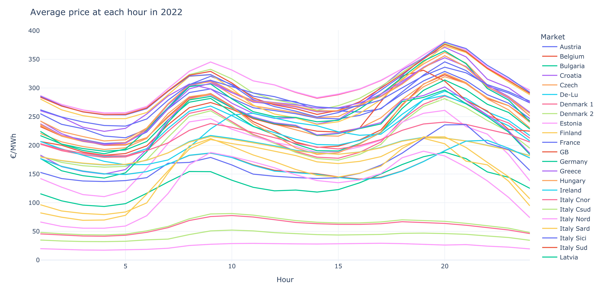

# Analysis into the EU 2022 Day-Ahead wholesale power market

Electricity in the EU is traded both on the exchange and over-the-counter (OTC) each with different time horizons. Trading takes place on the futures, day-ahead (DA) and intraday markets. On the futures market, companies agree on deliveries up to six year in advance named 'futures' on the exchange and 'forwards' in OTC trading. On the other hand, the spot market consists of solely DA and intraday markets with auctions taking place either daily or multiple times a day. The market clearing price falls (_almost_ exactly) on the intersection of the aggregated supply and demand curves, with most markets being 'pay-as-cleared' meaning all bids and offers below the market clearing price will be paid the same amount. This analysis will focus on potential revenue from various EU wholesale DA markets over the course of 2022.

## 1. Initial inspection of data

The dataset provided by SMARD, the information platform of the Bundesnetzagentur on the electricity market. It contains information on the following markets:
- Germany/Luxembourg (De-Lu)
- De-Lu Neighbors
- Belgium
- Denmark 1 & 2
- France
- Netherlands
- Norway 2
- Austria
- Poland
- Sweden 4
- Switzerland
- Czech
- Italy
- Slovenia
- Hungary

All the clearing prices are given in €/MWh, and data from EPEX GB 60min DA prices are merged into this DataFrame.

Although a convoluted plot, Figure 1.1 demonstrates that all the markets across Europe had fairly lower prices with little instability, however this all changes in the latter stages of 2021. All markets have become extremely volatile and express roughly the same trends (see `figures/da-prices.html` for further inspection into each market).

  

> Fig 1.1: Average daily clearing price from 2019 to 2022.

Violin plots, such as the ones in Figure 1.2 are useful way to gain insight into the distributions of different series. Comparisons can easily be made and the differences highlighted, e.g. De-Lu has a much longer and narrower profile than Poland, possibly indicating the potential for more revenue wehn trading due to the large spread. It should be noted that whilst France and GB contain several prices of greater than 2500 €/MWh, these points are omitted from the plot in order to allow for greater clarity of the violins.

  

> Figure 1.2: The distribution of market clearing prices.

Larger spreads tend to indicate the potential for higher revenue as if forecasted correctly, electricity can be bought lower and sold higher, generating more each day. The Netherlands, Sweden and Hungary all exhibit the greatest figures, each with an average daily spread of over 200 €/MWh.

  

> Figure 1.3: The average daily price spread.

Every market inspected in this analysis operates on a bimodal distribution, with the first peak occuring around 9am and the second at 8pm. This makes them ideal markets for dual-cycle batteries, with one cycle perfromed in the morning and one in the evening. Interestingly, whilst almost every country has their second peak at 8pm or later, Britain's falls earlier.

  

> Figure 1.4: The average price profile throughout the day.

Interactive plots of all the figures in Section 1 can be found as HTML files in in the foler `figures`.

## 2. Revenue analysis

## 3. Comments