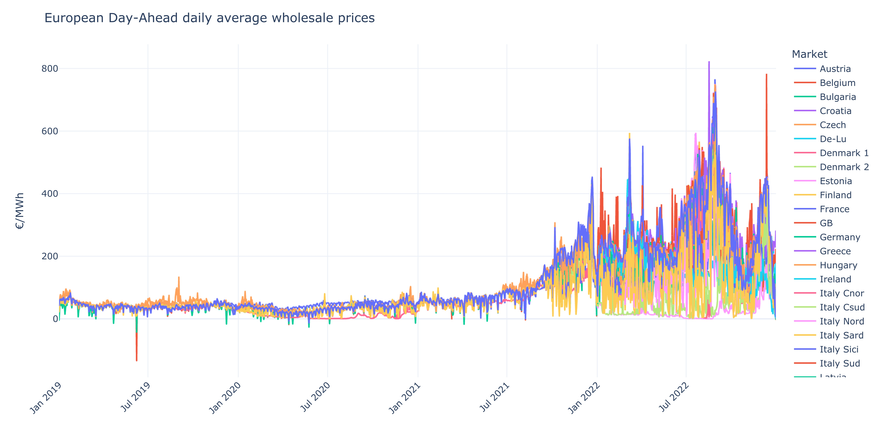
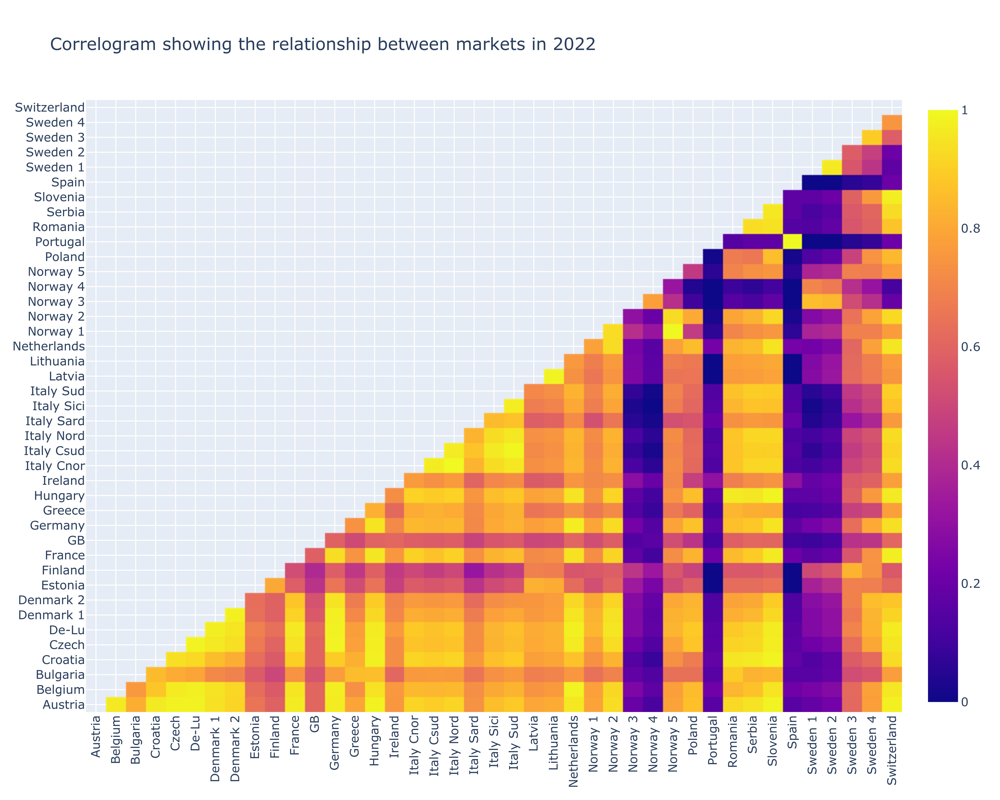
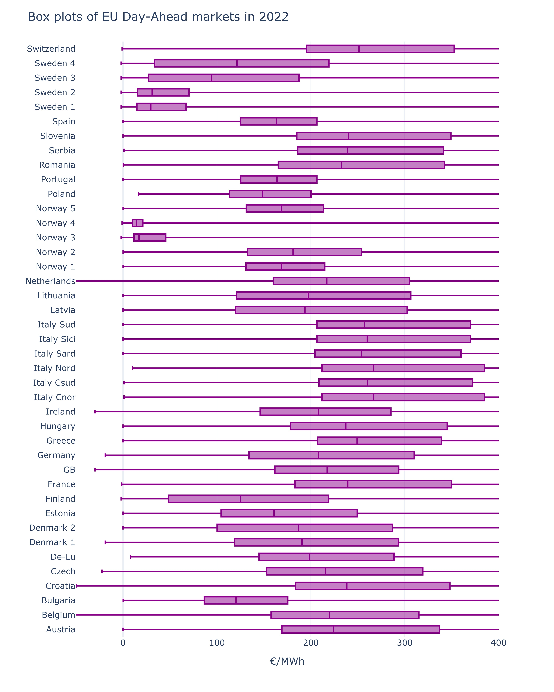
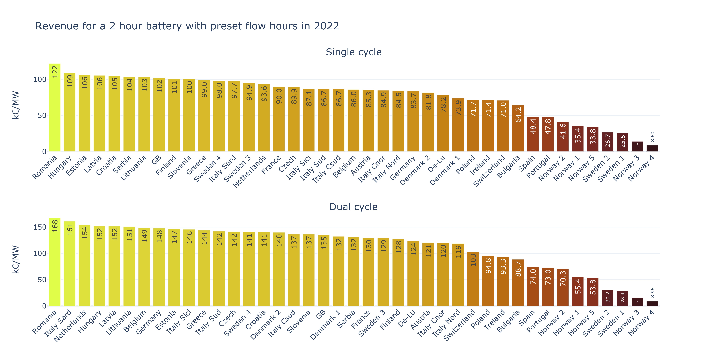

# Analysis into the EU 2022 Day-Ahead wholesale power market

Electricity in the EU is traded both on the exchange and over-the-counter (OTC) each with different time horizons. Trading takes place on the futures, day-ahead (DA) and intraday markets. On the futures market, companies agree on deliveries up to six year in advance named 'futures' on the exchange and 'forwards' in OTC trading. On the other hand, the spot market consists of solely DA and intraday markets with auctions taking place either daily or multiple times a day. The market clearing price falls (_almost_ exactly) on the intersection of the aggregated supply and demand curves, with most markets being 'pay-as-cleared' meaning all bids and offers below the market clearing price will be paid the same amount. This analysis will focus on potential revenue from various EU wholesale DA markets over the course of 2022.

## 1. Initial inspection of data

The dataset containing information on the majority of the markets is provided by SMARD, the information platform of the Bundesnetzagentur on the electricity market. It contains information on the following markets:
- Austria
- Belgium
- Czech
- De-Lu Neighbors
- Denmark 1 & 2
- France
- Germany/Luxembourg (De-Lu)
- Hungary
- Italy
- Netherlands
- Norway 2
- Poland
- Slovenia
- Sweden 4
- Switzerland

Data from Entsoe for the following countries is also merged into the dataframe:
- Croatia
- Estonia
- Finland
- Greece
- Ireland
- Latvia
- Lithuania
- Norway 1, 3, 4 & 5
- Portugal
- Romania
- Serbia
- Spain
- Sweden 1, 2 & 3

GB 60min DA data from EPEX is also pulled and merged into this DataFrame. For Italy, although there is zonal pricing in paying for supply, the PUN (national price) will be used to simplify matters - this is a fair simplication as the PUN is the consumption weghted average of all the zonal prices.

Although a convoluted plot, Figure 1.1 demonstrates that all the markets across Europe had fairly lower prices with little instability, however this all changes in the latter stages of 2021. All markets have become extremely volatile and express roughly the same trends (see `figures/da-prices.html` for further inspection into each market).

  

> Fig 1.1: Average daily clearing price from 2019 to 2022.

A correlation matrix is calculated using the Pearson product-moment correlation coefficient to measure the extent of linear correlation between the markets in 2022. This can be represented in a heatmap, where the lighter colours reflect a positive correlation between the markets, and the darker colours no correaltion. None of the markets have a negative correlation of any significance, as to be expected.

  

> Figure 1.2: A heatmap representing the correlation between markets.

Box plots, such as the ones in Figure 1.3, are useful way to gain insight into the locality, spread and skewness of of datasets by representing each series with quartiles. Comparisons can easily be made and the differences highlighted, e.g. Slovena has a much longer profile than Spain, indicating the potential for more revenue when trading due to the large spread. It should be noted that box plots also include 'whiskers' which represent the range of values, however as several markets contain prices upwards of 2500 €/MWh, the x axis has been limited in order to allow for greater clarity of the quartiles.

  

> Figure 1.3: The distribution of market clearing prices.

Larger spreads tend to indicate the potential for higher revenue as if forecasted correctly, electricity can be bought lower and sold higher, generating more each day. The Netherlands, Sweden and Hungary all exhibit the greatest figures, each with an average daily spread of over 200 €/MWh.

  

> Figure 1.4: The average daily price spread.

Every market inspected in this analysis operates on a bimodal distribution, with the first peak occuring around 9am and the second at 8pm. This makes them ideal markets for dual-cycle batteries, with one cycle perfromed in the morning and one in the evening. Interestingly, whilst almost every country has their second peak at 8pm or later, Britain's falls earlier.

  

> Figure 1.5: The average price profile throughout the day.

Interactive plots of all the figures in Section 1 can be found as HTML files in in the foler `figures`.

## 2. Revenue analysis

### 1 hour battery potential revenue

The maximum revenue possible in 2022 is calculated by simply subtracting the daily trough from the peak and summing over the course of the year (the day is split into AM/PM for dual cycle). It should be noted that this revenue is only possible with a perfect model for forecasting the DA clearing prices, and this analysis does not take into account the state of the battery left from the day prior i.e. in reality a discharged battery cannot discharge again in the early morning of the following day.

  

> Fig 2.1: Potential revenue for a 1 hour battery in 2022

### 2 hour battery revenue for preset flow times

A different approach is taken when calculating the revenue for a two hour battery. By inspecting the price profile of each market in Figure 1.5, two hour charging and discharging times are set for the entirety of the year and the revenues calculated from this. For the majority of markets this involves 03:00-05:00 charging and 19:00-21:00 discharging, with additional 13:00-15:00 charging and 07:00-09:00 discharging for dual cycles, although there is a slight variation. This circumvents the drawback of the previous analysis which did not take into account the state of the battery at the start of the day, the charging time always occurs first and discharging last each day.

  

> Fig 2.2: Revenue for a 2 hour battery in 2022 with preset flow times

This figure can almost be thought of as a minimum revenue, as requires very little anlysis prior to setting the times and involves no efforts to varying the flow times depending on external factors, such as seasonal and weekend differences. With a simple forecasting model adjusting for various other exogenous factors, the revenue will be greater.

## 3. Comments